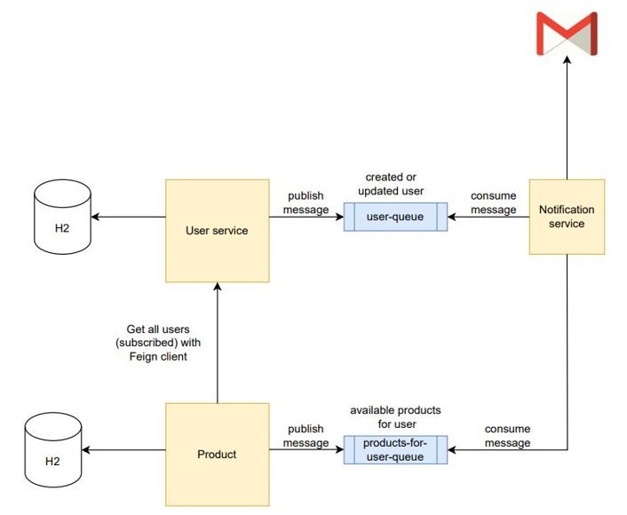

#  Split monolithic app to microservices - Final step

**Tasks:**

- Extract product service
- Create endpoint on product service to send all available products in email to all subscribed users
  - Product service fetch all subscribed users from user service with Feign client
  - Product service publish messages to new queue 
  - Notification service consume messages and send emails to subscribed users
- Delete monolithic application
