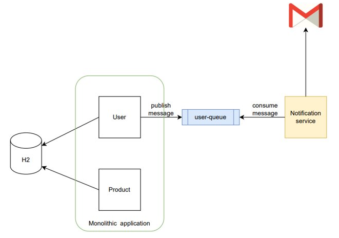

#  Split monolithic app to microservices - Step 1

 

**Tasks:**

- Extract notification service from monolithic application
- Publish user message to user-queue from monolith/user
- Consume user message with notification service
- For messaging use RabitMQ - configuration already added
