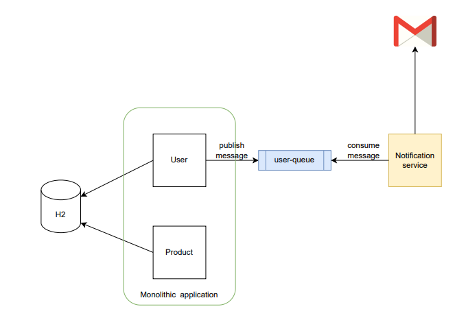

# Monolithic Application




- Run rabbitmq: run ```docker compose up``` in resources/rabbitmq
- ```mvn clean install```
- ```mvn spring-boot:run```
- **H2**: http://localhost:8081/h2-console 
- **Health check**: http://localhost:8081/actuator/health
- **RabbitMQ**: http://localhost:15672

**POST user:**
```
curl -d "{\"email\": \"user@email.com\",\"password\": \"passs\",\"receiveUpdate\": true}" -H "Content-Type: application/json" http://localhost:8081/api/users
```

**GET all users:**
```
curl -v "http://localhost:8081/api/users"
```

**DELETE by email:**
```
curl -X DELETE http://localhost:8081/api/users/user@email.com	
```
